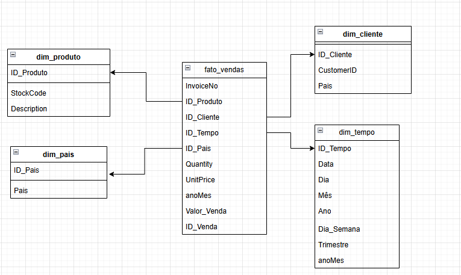

# JONATHAN_WITKOSKY_DDF_TECH_102024

Extração dos dados:

Foi utilizado o dataset "Online Retail" do Kaggle onde o dataset possui 541910 linhas em formato CSV - [Dataset](https://www.kaggle.com/datasets/vijayuv/onlineretail/data)

Modelagem dos dados:

o dataset foi modelado utilizando a linguagem Python, seguindo os princípios de Kimball, num modelo Star Schema para essa análise. A modelagem proposta ficou o seguinte:

Todo o passo a passo das transformações está no arquivo [onlineRetail](onlineRetail.ipynb) na seção "Transformações"

Análises:

Foram realizadas análises em SQL e posteriomente criado gráficos utilizando as bibliotecas Matplotlib e seaborn para criar a visualização dessas análises. Onde respondemos as seguintes perguntas:

Análise de Receita por Produto

- Quais foram os produtos mais vendidos? Link Dadosfera - [Produtos mais vendidos](https://metabase-treinamentos.dadosfera.ai/question/1678-quais-sao-os-produtos-mais-vendidos)
- Qual a receita gerada por produto ao longo do tempo? Link Dadosfera - [Receita gerada por produto](https://metabase-treinamentos.dadosfera.ai/question/1679-qual-a-receita-gerada-por-produto-ao-longo-do-tempo)

Análise de Cliente

- Quem são os clientes que mais gastam? Link Dadosfera - [Clientes que mais gastam](https://metabase-treinamentos.dadosfera.ai/question/1680-quem-sao-os-clientes-que-mais-gastam)
- Qual a frequência de compras de clientes específicos ao longo do tempo? Link Dadosfera - [Frequência de compras](https://metabase-treinamentos.dadosfera.ai/question/1681-qual-a-frequencia-de-compras-de-clientes-especificos-ao-longo-do-tempo)

Análise Temporal

- Quais são os meses ou trimestres com maior volume de vendas? Link Dadosfera - [Volume de Vendas](https://metabase-treinamentos.dadosfera.ai/question/1682-quais-sao-os-meses-com-maior-volume-de-vendas)
*Em meses e Trimestres

Análise Geográfica

- Quais países geram mais receita? Link Dadosfera - [Países que geram mais receita](https://metabase-treinamentos.dadosfera.ai/question/1683-quais-paises-geram-mais-receita)
- Relação entre o país do cliente e os produtos - Link Dadosfera - [Países Clientes x Produtos](https://metabase-treinamentos.dadosfera.ai/question/1685-qual-a-relacao-entre-o-paises-dos-clientes-e-os-produtos-comprados)

Análise de pedidos

- Quantidade de pedidos cancelados - Link Dadosfera [Ordens Cancelados](https://metabase-treinamentos.dadosfera.ai/question/1676-quantidades-de-ordens-canceladas)
